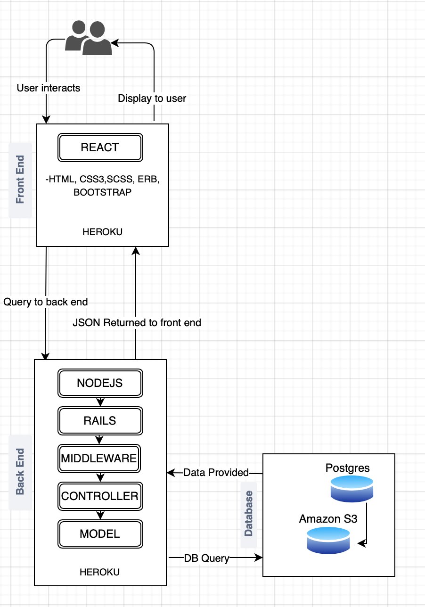
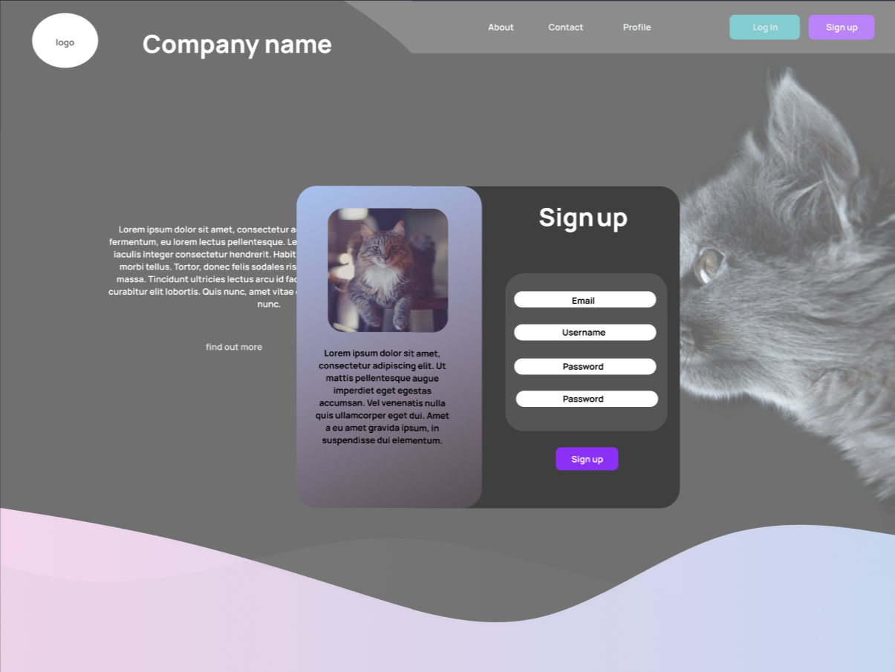

# R1 Overview

### Purpose

The purpose of this application is to provide a functional and visually appealing system for animal rescue and foster carers to track the development and health of their animals.

### Target Audience

Animal rescue and Foster carers

### Functionality / Features

- Home landing page
- About page
- User interface
  - Login
  - Logout
  - Account page
- Page showing all current animals
- Individual animal pages showing name, age, photo, microchip
  - Shows more details if logged in - daily weight, graph of weight over time, user notes
  - Form for logged in users to update weight and record notes
- Donate button, social links and share buttons

### Tech Stack

**Front-End:** HTML5, CSS3, SCSS, Embedded Ruby, Bootstrap, Javascript, React

**Back-End:** Ruby, Ruby on Rails, Node

**Database:** Postgres

**Deployment:** Heroku, Amazon Web Services

**Biz-Tools:** Trello 

**Dev Ops:** GitGithub, VS Code, Bundler, Balsamic, Figma

**Assets/Packaging:** Webpack, Babel, Yarn

# R2 Dataflow Diagram

# R3 App Architecture Diagram

# R4 User Stories

### Development Over Time

The application grew out of a need for carers to be able to record their charges daily weight. After doing some qualitative research into the topic, we discovered that carers also wanted to be able to visually see this information represented over time in a graph. A main request was the carers desire to also have a note taking element where they could record behaviour of special interest.

After further investigation, it was revealed that carers are also required to record information about their charges when they receive them (name, age, photo, species, if they are desexed and/or microchiped) and when they are adopted out (to whom). It made sense that this data was also recorded alongside the daily weight and notes for each animal.

As we were then going to be recording all the relevant data about the animals in the foster home, a decision was made to also display some (but not all) of this data to the public in the interest of enabling the animals to be adopted out. Adopters want to be able to see an overview of the animals they are considering adopting, including a name, photo and a blurb about behavioural characteristics (such as whes along with other animals/children). 

### Types of Users

##### Foster Carers

- Want to be able to record their charges daily habits in a simple, convenient manner
- Want to be able to quickly access records and charts of their charges behaviour over time
- Want to be able to take notes on any peculiarities their charges display during the day
- Want to be able to record and retrieve information about their charges that they are legally obligated to keep (eg, microchipping)
- Want their charges to be adopted out to good homes

##### Adopters

- Want to quickly gain an overview of the different animals that are available for adoption
- Want to be able to see the relevant details about an animal I'm considering adopting, including behavioural characteristics (eg, gets along with other animals/children)
- Want to be able to contact the foster carers for more information

# R5 Wireframes

##### Wireframes

##### Figma

# R6 Planning Methodology

The planning methodology we chose to utilise while building this application is trello. Our board can be found [here](https://trello.com/b/touSZZjx/cat-rescue).

We divided the trello board into three main components:

- Tasks to be done
- Tasks underway
- Tasks done

Each member of our team has our own section within the tasks underway component to allow for a clear visual represention of who is doing what at any given moment.

Below are some screenshots of the trello board in action:

